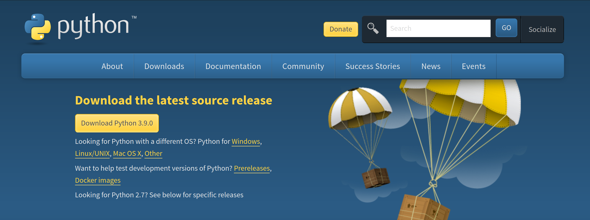
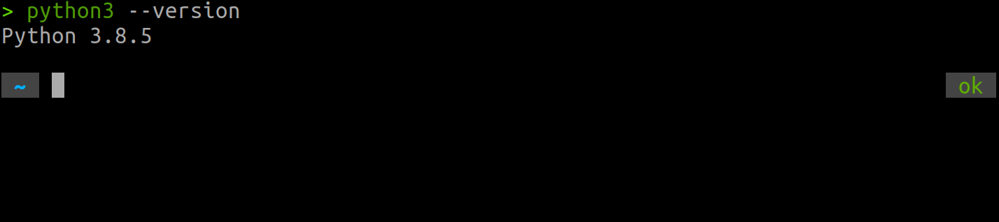
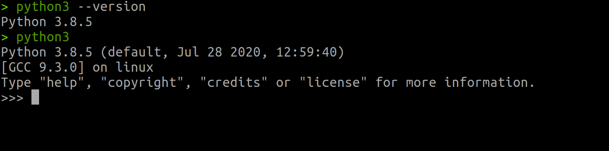
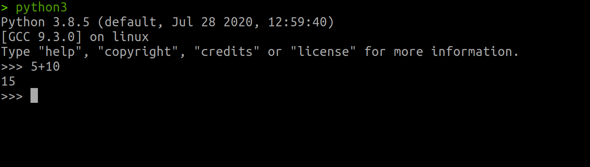
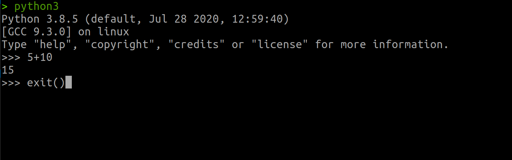
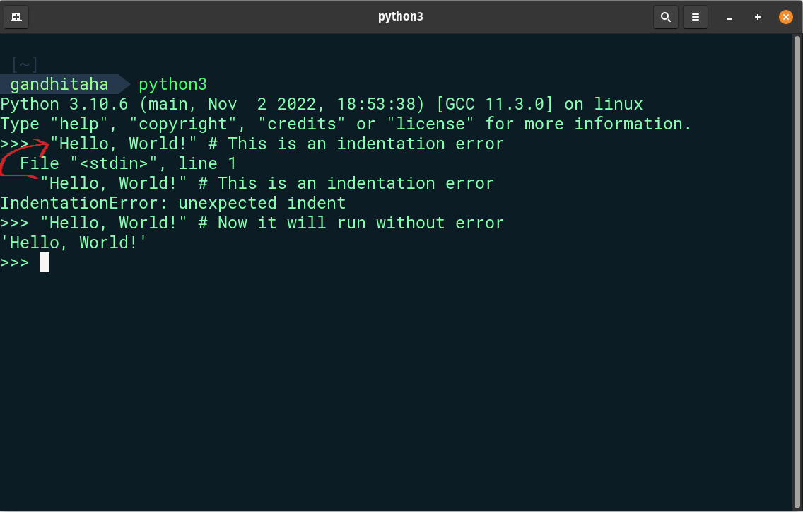
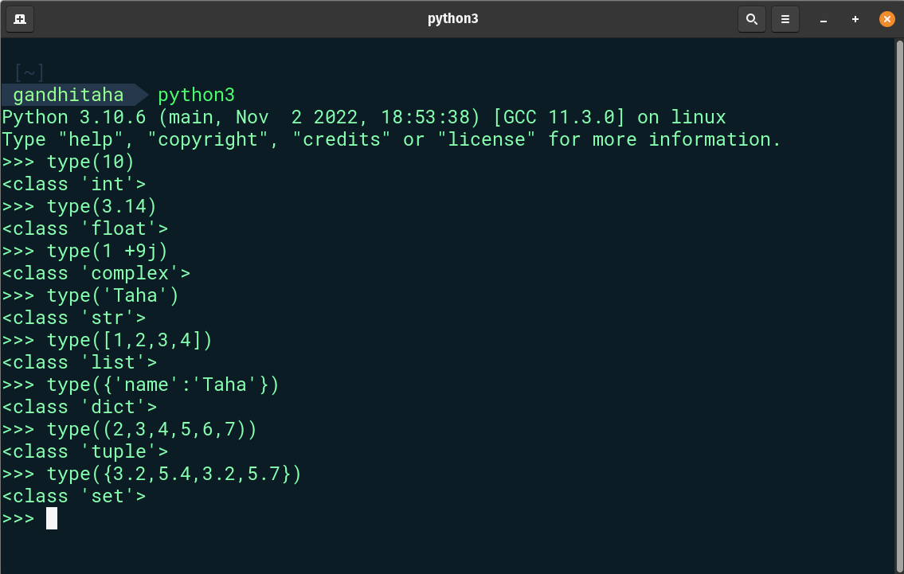
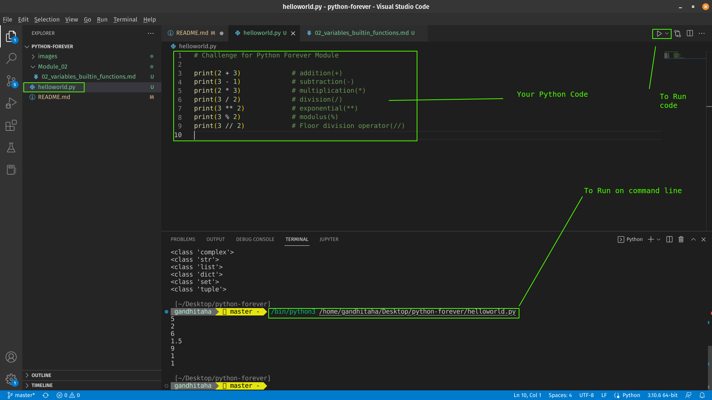

# Python-Forever
<table>

<tr><td>

|   Modules  | Topics                                                    |
|-----------|:------------------------------------------------------------------------------------------------------------- |
|  01  | [Introduction](./readme.md)
|  02   |  [Data Types](./02_Module_Data_types/02_day_data_types.md)  |
|  03   |  [Booleans, Operators, Date](./03_Module_Booleans_operators_date/03_booleans_operators_date.md)  |
|  04   |  [Conditionals](./04_Module_Conditionals/04_day_conditionals.md)  |
|  05   |  [Arrays](./05_Module_Arrays/05_day_arrays.md)  |
|  06   |  [Loops](./06_Module_Loops/06_day_loops.md) |
|  07   |  [Functions](./07_Module_Functions/07_day_functions.md)  |
|  08   |  [Objects](./08_Module_Objects/08_day_objects.md)     |
|  09   |  [Higher Order Functions](./09_Module_Higher_order_functions/09_day_higher_order_functions.md)   |
|  10   |  [Sets and Maps](./10_Module_Sets_and_Maps/10_day_Sets_and_Maps.md)  |
|  11   |  [Destructuring and Spreading](./11_Module_Destructuring_and_spreading/11_day_destructuring_and_spreading.md)    |
|  12   |  [Regular Expressions](./12_Module_Regular_expressions/12_day_regular_expressions.md)   |
|  13   |  [Console Object Methods](./13_Module_Console_object_methods/13_day_console_object_methods.md)|
|  14   |  [Error Handling](./14_Module_Error_handling/14_day_error_handling.md) |
|  15   |  [Classes](./15_Module_Classes/15_day_classes.md)  | 

</td><td>

|   Modules  | Topics                                                    |
|-----------|:------------------------------------------------------------------------------------------------------------- |
|  16   |  [Python Date time](./16_module_Python_date_time/16_python_datetime.md)      |     
|  17   |  [Exception Handling](./17_module_Exception_handling/17_exception_handling.md)|    
|  18   |  [Regular Expressions](./18_module_Regular_expressions/18_regular_expressions.md)|    
|  19   |  [File Handling](./19_module_File_handling/19_file_handling.md)   |
|  20   |  [Python Package Manager](./20_module_Python_package_manager/20_python_package_manager.md)    |
|  21   |  [Classes & Objects](./21_module_Classes_and_objects/21_classes_and_objects.md)      |
|  22   |  [Web Scraping](./22_module_Web_scraping/22_web_scraping.md)      |
|  23   |  [Virtual Environment](./23_module_Virtual_environment/23_virtual_environment.md)|
|  24   |  [Statistics](./24_module_Statistics/24_statistics.md)      |
|  25   |  [Pandas](./25_module_Pandas/25_pandas.md)     |
|  26   |  [Python web](./26_module_Python_web/26_python_web.md)    |
|  27   |  [Python with MongoDB](./27_module_Python_with_mongodb/27_python_with_mongodb.md)     |
|  28   |  [API](./28_module_API/28_API.md)     |
|  29   |  [Building API](./29_module_Building_API/29_building_API.md)     |
|  30   |  [Conclusions](./30_module_Conclusions/30_conclusions.md)      |

</td></tr> </table>

<center>Enjoy Coding 😇️ </center>
<div align="center">
<h1> Python Forever: Module 01 - Introduction </h1>
 <a class="header-badge" target="_blank" href="https://www.linkedin.com/in/taha-gandhi-5525b1160">
  
  </a>
  <a class="header-badge" target="_blank" href="https://twitter.com/gandhi_taha">
  
  </a>
  </div>
<br>

## Module 01

- [ Python Forever](#Python-Forever)
  - [Welcome](#Hello-and-Welcome-Guys)
  - [Introduction](#introduction)
  - [Why Python ?](#why-python-)
  - [Environment Setup](#environment-setup)
    - [Installing Python](#installing-python)
    - [Python Shell](#python-shell)
    - [Installing Visual Studio Code](#installing-visual-studio-code)
      - [How to use visual studio code](#how-to-use-visual-studio-code)
  - [Basic Python](#basic-python)
    - [Python Syntax](#python-syntax)
    - [Python Indentation](#python-indentation)
    - [Comments](#comments)
    - [Data types](#data-types)
      - [Number](#number)
      - [String](#string)
      - [Booleans](#booleans)
      - [List](#list)
      - [Dictionary](#dictionary)
      - [Tuple](#tuple)
      - [Set](#set)
    - [Checking Data types](#checking-data-types)
    - [Python File](#python-file)
  - [ Practice - 01](#-exercises---day-1)
    - [Practice: Level 1](#exercise-level-1)
    - [Practice: Level 2](#exercise-level-2)
## Hello and Welcome Guys

**Cheers** for opting to this course _Python Forever_. In this module you will learn from scratch about in and out of python with challenges to solve at end.

**You can even join us our online  Python Course training that will help you gain in-depth knowledge on all the essential concepts**  <br>[Join Now](Whatsapp link to add)

## Introduction
 Python is a popular programming language. It was created by Guido van Rossum, and released in 1991.
 Python is a high-level programming language for general-purpose programming. It is open source.This python course will help you learn the latest version of Python 3, in a step by step fashion.

 It is used for:

- web development (server-side),
- software development,
- mathematics,
- system scripting.

## Why Python? 

The python language is one of the most accessible programming languages available because it has simplified syntax and not complicated, which gives more emphasis on natural language. Due to its ease of learning and usage, python codes can be easily written and executed much faster than other programming languages. Python is highly embraced language in the data science and machine learning community. I hope this is enough to convince you to start learning python.

## Environment Setup

### Installing Python
To work with python we need to install python. So let's [download](https://www.python.org/downloads/)
python click appropriate flavour of script to your O.S.
[](https://www.python.org/downloads/)
If you are on a linux machine. Follow these commands on Debian:
```shell
sudo apt-get update
```
```shell
sudo apt install build-essential zlib1g-dev \
libncurses5-dev libgdbm-dev libnss3-dev \
libssl-dev libreadline-dev libffi-dev curl
```
```shell
sudo apt-get install python3 -y
```
Verify the installation
```shell
python3 --version
```


We can see on terminal, It shows us we are using _python 3.8.5_, If you mange to see the python version, well done. Python has been installed on your machine.
<br>

### Python Shell

Python is an interpreted scripting language, so it doesn't got to be compiled. It means it executes the code line by line. Python comes with a _Python Shell (Python Interactive Shell)_. It's wont to execute one python command and obtain the result.

Python Shell waits for the python code from the user. Once you enter the code, It interprets the code and shows the end in subsequent line.
Open your terminal or command prompt(cmd) and write:
```shell
python3
```


Python has two basic modes: script and interactive. The normal mode is the mode where the scripted and finished . py files are run in the Python interpreter. Interactive mode is a command line shell which gives immediate feedback for each statement, while running previously fed statements in active memory.

Let write our very first script on this interactive python shell.



Well done, you wrote your first python script on python interactive shell. How do we close this shell ? To exit write **exit()** on shell.


## Basic Python

### Python Syntax

A Python script can be written in Python interactive shell or in the code editor. A Python file has an extension .py.

### Python Indentation

An indentation is a white space in a text. Indentation in many languages is used to increase code readability, however Python uses indentation to create block of codes. In other programming languages curly brackets are used to create blocks of codes instead of indentation. One of the common bugs when writing python code is wrong indentation.



### Comments

Comments are very important to make the code more readable and to leave remarks in our code. Python does not run comment parts of our code.
Any text starting with hash(#) in Python is a comment.

**Example: Single Line Comment**

```shell
    # This is the first comment
    # This is the second comment
    # Python is eating the world
```

**Example: Multiline Comment**

Triple quote can be used for multiline comment if it is not assigned to a variable

```shell
"""This is multiline comment
multiline comment takes multiple lines.
python is eating the world
"""
```

### Data types

In Python there are several types of data types. Let us get started with the most common ones. Different data types will be covered in detail in other sections. For the time being, let us just go through the different data types and get familiar with them. You do not have to have a clear understanding now.

#### Number

- Integer: Integer(negative, zero and positive) numbers
    Example:
    ... -3, -2, -1, 0, 1, 2, 3 ...
- Float: Decimal number
    Example
    ... -3.5, -2.25, -1.0, 0.0, 1.1, 2.2, 3.5 ...
- Complex
    Example
    1 + j, 2 + 4j

#### String

A collection of one or more characters under a single or double quote. If a string is more than one sentence then we use a triple quote.

**Example:**

```py
'Taha'
'Germany'
'Python'
'I love teaching'
'I hope you are enjoying the first day of Python Forever Challenge'
```

#### Booleans

A boolean data type is either a True or False value. T and F should be always uppercase.

**Example:**

```python
    True  #  Is the light on? If it is on, then the value is True
    False # Is the light on? If it is off, then the value is False
```

#### List

Python list is an ordered collection which allows to store different data type items. A list is similar to an array in JavaScript.

**Example:**

```py
[0, 1, 2, 3, 4, 5]  # all are the same data types - a list of numbers
['Banana', 'Orange', 'Mango', 'Avocado'] # all the same data types - a list of strings (fruits)
['Germany','India', 'Sweden','Norway'] # all the same data types - a list of strings (countries)
['Banana', 10, False, 9.81] # different data types in the list - string, integer, boolean and float
```

#### Dictionary

A Python dictionary object is an unordered collection of data in a key value pair format. 

**Example:**

```py
{
'first_name':'Taha',
'last_name':'Gandhi',
'country':'Germany', 
'age':1250, 
'is_married':False,
'skills':['JS', 'React', 'Node', 'Python','ML']
}
```

#### Tuple

A tuple is an ordered collection of different data types like list but tuples can not be modified once they are created. They are immutable.

**Example:**

```py
('Taha', 'Akshay', 'Azam', 'Pardis', 'Lidiya') # Names
```

```py
('Earth', 'Jupiter', 'Neptune', 'Mars', 'Venus', 'Saturn', 'Uranus', 'Mercury') # planets
```

#### Set

A set is a collection of data types similar to list and tuple. Unlike list and tuple, set is not an ordered collection of items. Like in Mathematics, set in Python stores only unique items.

In later sections, we will go in detail about each and every Python data type.

**Example:**

```py
{2, 4, 3, 5}
{3.14, 9.81, 2.7} # order is not important in set
```

### Checking Data types

To check the data type of certain data/variable we use the **type** function. In the following terminal you will see different python data types:



### Python File

First open your project folder, 30ModulesOfPython. If you don't have this folder, create a folder name called 30ModulesOfPython. Inside this folder, create a file called helloworld.py. Now, let's do what we did on python interactive shell using visual studio code.

The Python interactive shell was printing without using **print** but on visual studio code to see our result we should use a built in function *print(). The *print()* built-in function takes one or more arguments as follows *print('arument1', 'argument2', 'argument3')*. See the examples below.

**Example:**

The file name is helloworld.py

```py
# Module 1 - Python Forever Challenge

print(2 + 3)             # addition(+)
print(3 - 1)             # subtraction(-)
print(2 * 3)             # multiplication(*)
print(3 / 2)             # division(/)
print(3 ** 2)            # exponential(**)
print(3 % 2)             # modulus(%)
print(3 // 2)            # Floor division operator(//)

# Checking data types
print(type(10))          # Int
print(type(3.14))        # Float
print(type(1 + 3j))      # Complex number
print(type('Taha'))  # String
print(type([1, 2, 3]))   # List
print(type({'name':'Taha'})) # Dictionary
print(type({9.8, 3.14, 2.7}))    # Set
print(type((9.8, 3.14, 2.7)))    # Tuple
```

To run the python file check the image below. You can run the python file either by running the green button on Visual Studio Code or by typing *python helloworld.py* in the terminal .



🌕  You are amazing. You have just completed Module 1 challenge and you are on your way to greatness. Now do some exercises for your brain and muscles.

## 💻 Exercises - Module 1

### Exercise: Level 1

1. Check the python version you are using
2. Open the python interactive shell and do the following operations. The operands are 3 and 4.
   - addition(+)
   - subtraction(-)
   - multiplication(\*)
   - modulus(%)
   - division(/)
   - exponential(\*\*)
   - floor division operator(//)
3. Write strings on the python interactive shell. The strings are the following:
   - Your name
   - Your family name
   - Your country
   - I am enjoying 30 Modules of python
4. Check the data types of the following data:
   - 10
   - 9.8
   - 3.14
   - 4 - 4j
   - ['Taha', 'Python', 'Germany']
   - Your name
   - Your family name
   - Your country

### Exercise: Level 2

1. Create a folder named day_1 inside Python Forever folder. Inside day_1 folder, create a python file helloworld.py and repeat questions 1, 2, 3 and 4. Remember to use _print()_ when you are working on a python file. Navigate to the directory where you have saved your file, and run it.

### Exercise: Level 3

1. Write an example for different Python data types such as Number(Integer, Float, Complex), String, Boolean, List, Tuple, Set and Dictionary.
2. Find an [Euclidian distance](https://en.wikipedia.org/wiki/Euclidean_distance#:~:text=In%20mathematics%2C%20the%20Euclidean%20distance,being%20called%20the%20Pythagorean%20distance.) between (2, 3) and (10, 8)


[<< Module 01](/README.md) | [Module 02 >>](/Module_02/02_variables_builtin_functions.md)